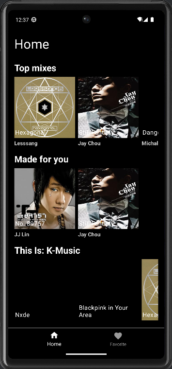
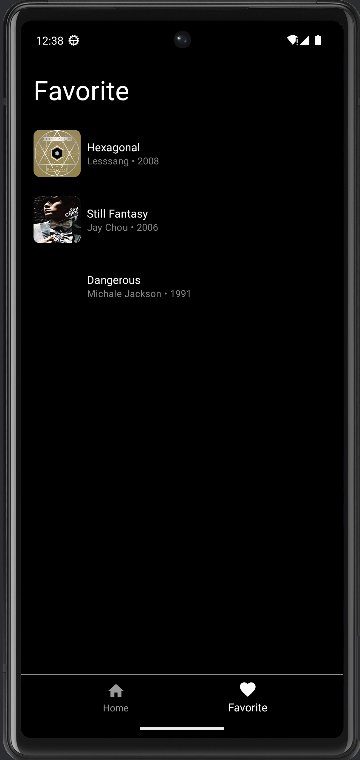
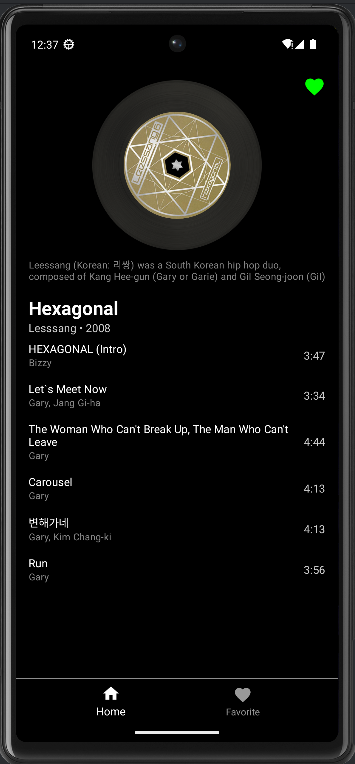
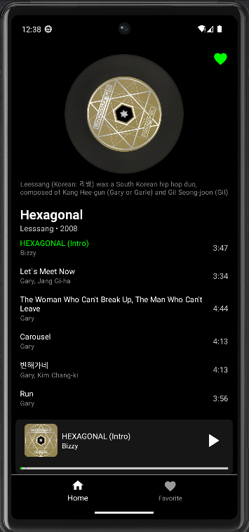
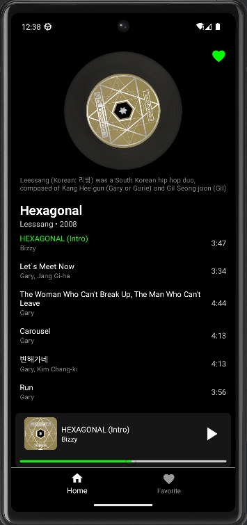

# Echo Tine

This project is an Android mobile music player with customized user functions.

The client adopted the Android Jetpack Library for an engaging and intuitive user experience. HTTP requests and responses are handled by the Retrofit package. Data is stored in a Room NoSQL database. The app also integrates with Google ExoPlayer for a robust music playback experience.

## Demonstration

This is the home page of the application. Different playlists of music are recommended based on their popularity, genre, and past user activities:

Navigate from the Bottom Bar to access the favorite page, which lists the user's favorite playlists:

By clicking on the icon of any playlist, the user can view all songs in the playlist:

The user can Favorite or unfavorite each playlist by clicking the heart icon on the top right.

By clicking on any song in the playlist, the user can start playing the song, which begins from the start.

By dragging the progression bar of the song, you can play the song from any time, and pause or restart the playing process:

After the song ends, the next songs in the playlist are played in sequence.
